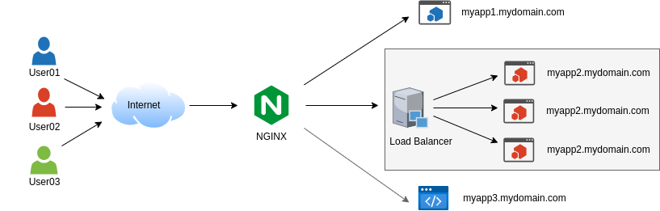

## Curso sobre Nginx- Reverse Proxy

Atraves do Curso foi possivel implementar uma solucao de proxy reverso expondo as aplicacoes, e tambem trabalhando com Balanceador de carga (Load Balancer) entre as aplicacoes de Conversao de Temepratura.

- Nginx
`http://127.0.0.1.nip.io:8080/`

- Pagina Azul
`http://blue.127.0.0.1.nip.io:8080/`

- Pagina Verde
`http://blue.127.0.0.1.nip.io:8080/`

- Conversao de Temperatura
`http://conversao.127.0.0.1.nip.io:8080/`

** Dentro da configuracao de redirecionamento da aplicacao de conversao de temperatura foi ativado o servico de `upstream` onde e definido o Load Balancer, e flag `weight` com a aplicacao conversao01 recebendo mais trafego.

